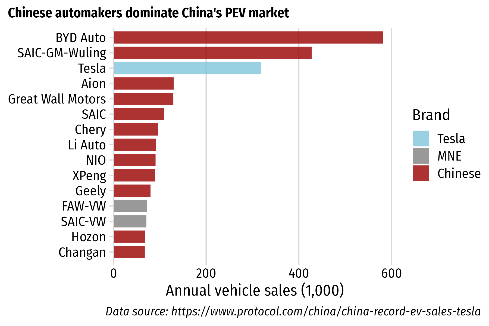

---

class: inverse, middle, center

# Institutions

# Market Conditions 

# Policies

---

class: inverse, middle, center

.leftcol[

# .orange[Institutions]

# Market Conditions 

# Policies

]

.rightcol[

 

## 1) The Joint Venture System

## 2) Local Protectionism 

]

---

class: center

# The Chinese Joint Venture System

## 1980s: 以市场换技术 = “Exchange market for technology”

--

???

Past research suggests system has largely failed to transfer technology

(Brandt & Thun, 2010; Feng, 2010; Howell, 2016; Huang, 2003; Lazonick & Li, 2012; Nam, 2011)

---

class: inverse, middle, center

### “这就像吸食鸦片一样，一旦你沾染上了就永远也无法戒掉。”

何光远, 中国前机械工业部部长

 

### “It's like opium. Once you've had it you will be addicted forever.”

Guangyuan He, Former Minister of Machinery and Industry (Reuters, 2012)

---

class: center 

## JV system creates disincentives for industry incumbents to innovate

 

.leftcol[

### Multinational OEMs lack incentives to bring cutting-edge technologies

]

.rightcol[

### Chinese JV partners lack incentives to independently innovate

]

---

background-color: #FFF
class: middle, center

### While MNEs dominate global vehicle markets, Chinese firms sell most PEVs in China

---

background-color: #FFF
class: middle, center

### While MNEs dominate global vehicle markets, Chinese firms sell most PEVs in China

---

background-color: #FFF
class: middle, center

## April 2018: JV requirement dropped for PEVs

--

---

class: center, center, middle

## Local protectionism incubated early experimentation

---

class: inverse, middle, center

.leftcol[

# Institutions

# .orange[Market Conditions]

# Policies

]

--

.rightcol[

 

.left[

## 1) Lower bar for selling PEVs

## 2) Infrastructure 

]]

---

class: center

## Chinese buyers are more willing to adopt BEVs

.leftcol65[

]

.rightcol35[

     

.left[.font80[Helveston et al. (2015) "Will subsidies drive electric vehicle adoption? Measuring consumer preferences in the U.S. and China" _Transportation Research Part A: Policy and Practice_. 73, 96–112. DOI: [10.1016/j.tra.2015.01.002](https://www.sciencedirect.com/science/article/abs/pii/S0965856415000038)]]

]

---

class: center, middle 

### Chinese buyers are willing to accept relatively lower BEV driving ranges

---

# .center[Infrastructure]
 
 

--

.leftcol[

### .center[World's largest charging network]

- End of 2020, China had 800,000 chargers installed.
- 112,000 chargers installed in December 2020 alone.

]

--

.rightcol[

### .center[World's largest HSR network]

- China's high-speed rail network recently surpassed the length of the equator at just over 40,000 km long

]

---

class: inverse, middle, center

.leftcol[

# Institutions

# Market Conditions

# .orange[Policies]

]

--

.rightcol[

 
 

## Bigger Sticks & Carrots

]

---

.leftcol[

## .center[Consumers]

- **Purchase Subsidies**:
    - RMB 50,000 (USD $8,200) for PHEVs
    - RMB 60,000 (USD $9,800) for BEVs
- **PEV exemptions from restrictions**
    - Shanghai license plates auction for ~$15,000 (free for PEVs)
    - Unlimited driving during "Rush Hour" (7am – 8pm)

]

--

.rightcol[

## .center[OEMs]

- **Dual Credit System**: require annual credits for meeting fuel economy standards & selling PEVs.
- Tesla earned $1.58 billion from credit sales in 2020 (.green[$721 million] profit would have been .red[-$859 million] loss).

]

---

class: middle, center, inverse

# Policies that make ICEVs more expensive than PEVs increase PEV adoption
