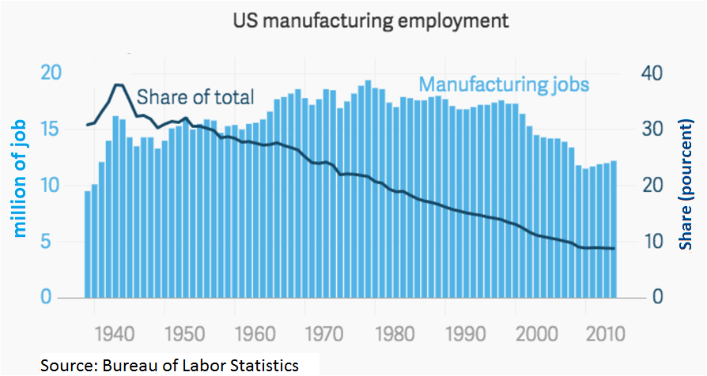
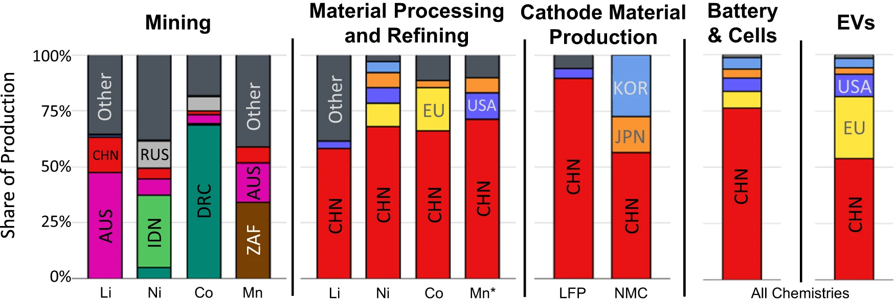
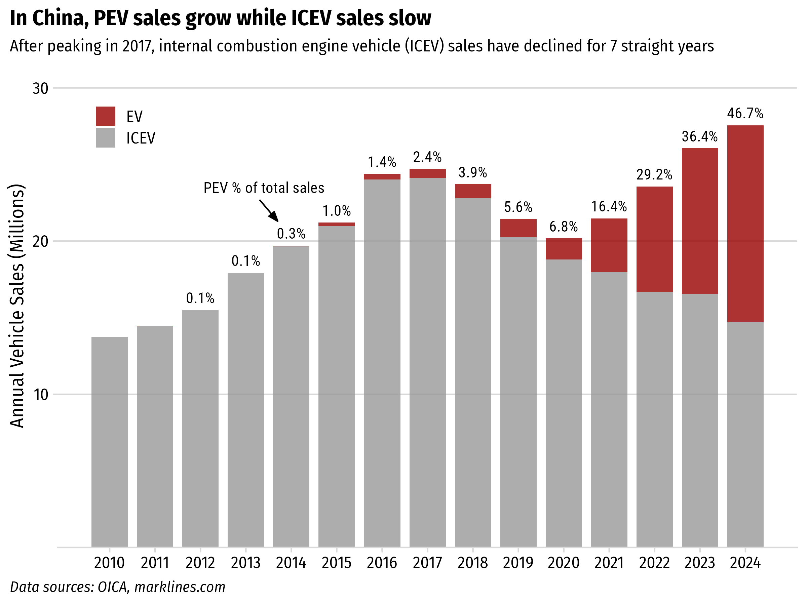
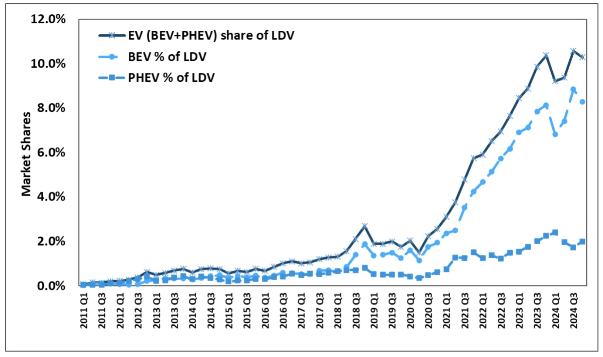
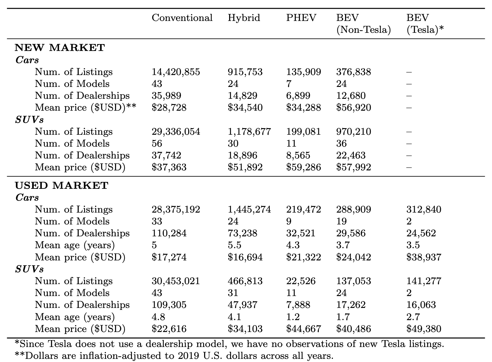

class: middle, center, inverse

# New Political Reality:

 

# Nationalism > Globalization

## (Security > Efficiency)

---

## .center[Manufacturing job loss (~5M since 2000)]

- Long term economic transition towards services
- "Hollowing out" of US industrial base

https://en.wikipedia.org/wiki/Manufacturing_in_the_United_States

---

## .center[Rise Chinese dominance in clean tech supply chains]

.leftcol[

#### .center[EV battery supply chain]

.font80[Cheng, Anthony L., et al. "Electric vehicle battery chemistry affects supply chain disruption vulnerabilities." Nature Communications 15.1 (2024): 2143.]

]

.rightcol[

#### .center[Solar module supply chain]

.font80[IEA Special report 2022: Solar PV Global Supply Chains, https://www.iea.org/reports/solar-pv-global-supply-chains]

]

---

# .center[**Bipartisan goal**: The US needs to counter China's lead in clean energy tech]

 

--

## **Keep Chinese clean tech out of US market**: Steep tariffs on imported Chinese EVs, batteries, PV modules

--

## **Keep Chinese firms out of US clean tech supply chains**: IRA restrictions on EV subsidy elligiblity, stricter Foreign Entities of Concern (FEOC) rules

---

# .center[Countering China by Investing in Manufacturing]

 

## **IRA Strategy**: Investing in *manufacturing* will lead to enduring support for clean tech through local jobs & economic benefits

 

--

## ...strategy hasn't entirely worked 😔 (2 years wasn't enough time)

---

class: inverse, middle, center

# Electric Vehicles

---

background-color: #fff

---

background-color: #fff

## .center[EV sales in US reaching ~10% of sales]

.font80[Source: Argonne National Lab, https://www.anl.gov/ev-facts/model-sales]

---

class: center

.leftcol70[

.font70[Source: https://www.iea.org/reports/global-ev-outlook-2024/executive-summary]

]

.rightcol30[

### The EV sector has an affordability problem (except in China)

]

---

class: center

### China offers more affordable BEVs across all range categories

Data scraped from autocango.com (China) and carsheet.io (USA)

---

class: center

### China offers more affordable BEVs across all range categories

Data scraped from autocango.com (China) and carsheet.io (USA)

---

class: center

### China offers more affordable BEVs across all range categories

Data scraped from autocango.com (China) and carsheet.io (USA)

---

background-image: url("images/top-four-1.png")
background-size: cover

---

background-image: url("images/top-four-2.png")
background-size: cover

---

## .center[**Opportunities**]

.leftcol[

## Chinese FDI into U.S.

### **Gotion batteries**: Multi-billion dollar investments in Illinois and Michigan

### **Challenge**: Uncertainty around Foreign Entities of Concern (FEOC) status

]

--

.rightcol[

## Technology Licensing Agreements

### **Ford-CATL**: Licensing battery technology in a Michigan plant

### **Challenge**: CATL was recently added to DOD's list of “Chinese military companies”

]

---

class: center, middle, inverse

# Using vehicle listings to quantify EV market development

---

class: center, middle

