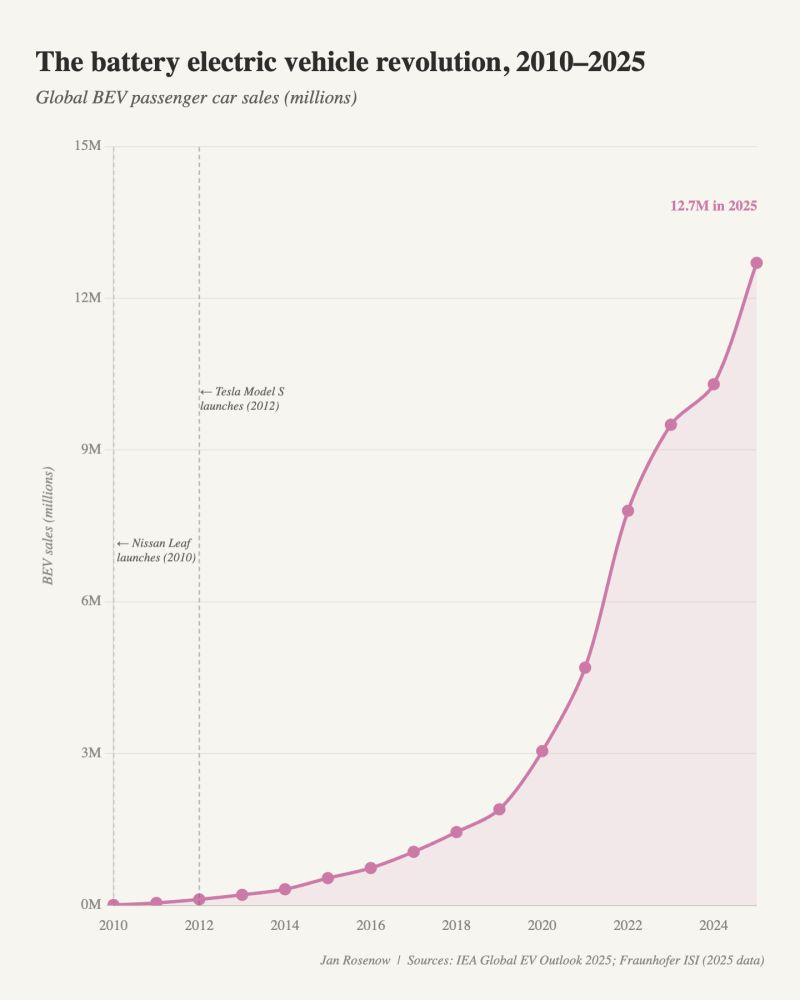
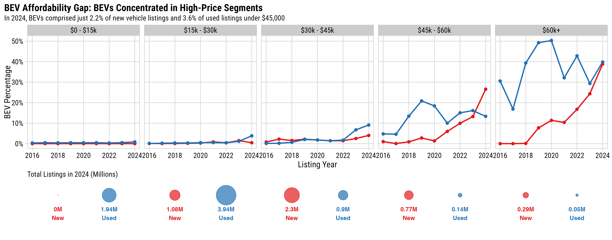
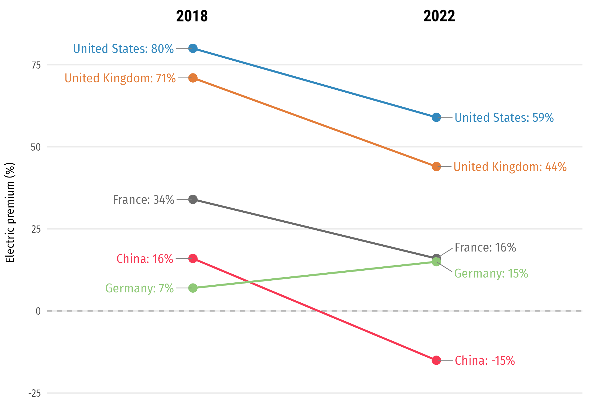
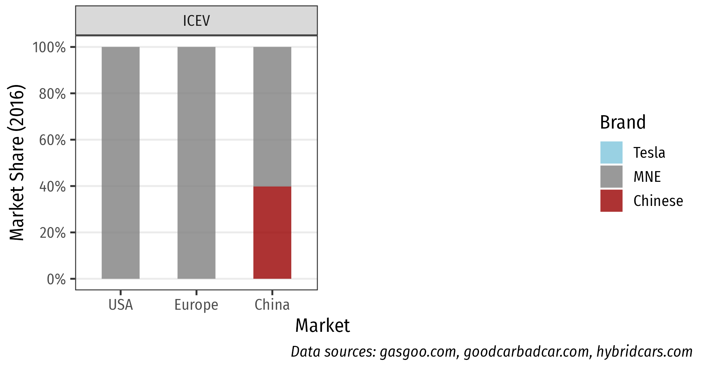
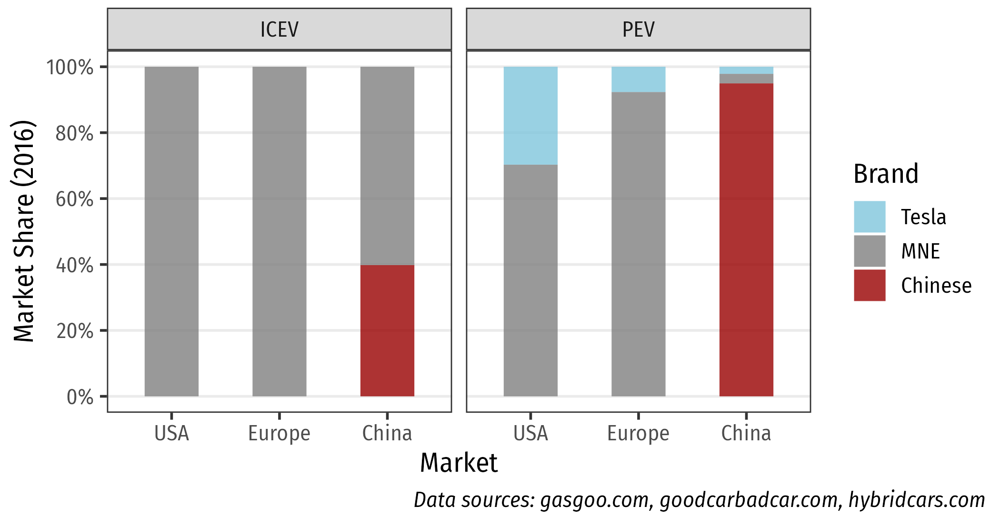

```{r, child="setup.Rmd"}
```

<center>

.font70[https://www.iea.org/reports/global-ev-outlook-2025]
</center>

---

background-color: #fff

<center>

</center>

---

# .center[China is driving the EV revolution]

<br>

--

### PEV sales (BEV + PHEV): **1.37 M (2020) --> 16.5 M (2025)**

<div><span class="tab"><span class="tab"><span class="tab"></span>&nbsp;&nbsp;&nbsp;(54.8% of sales)</div>

--

<br>

### PEV exports (BEV + PHEV): **0.2 M (2020) --> 2.62 M (2025)**

<div><span class="tab"><span class="tab"><span class="tab"></span>&nbsp;&nbsp;&nbsp;(43% of vehicle exports)</div>

---

background-color: #fff

<center>

</center>

---

background-color: #fff

<center>

</center>

---

class: center

### China offers more affordable BEVs across all range categories

<center>

</center>

Data scraped from autocango.com (China) and carsheet.io (USA)

Interactive version at https://jhelvy.github.io/science-2025/

---

class: center

### China offers more affordable BEVs across all range categories

<center>

</center>

Data scraped from autocango.com (China) and carsheet.io (USA)

Interactive version at https://jhelvy.github.io/science-2025/

---

class: center

### China offers more affordable BEVs across all range categories

<center>

</center>

Data scraped from autocango.com (China) and carsheet.io (USA)

Interactive version at https://jhelvy.github.io/science-2025/

---


---

# Strategic Implications

<br>

### **Global Market Share Erosion**: U.S. autos will not be competitive abroad without affordable EVs

<br>

### **Trade Imbalance**: U.S. could go from net vehicle _exporter_ to _importer_ 

### (U.S. exported $15B in vehicles and parts to Canada in 2024 🇨🇦)

<br>

### **Exployment Impacts**:  U.S. auto employs 10.1 million Americans, $730B in annual paychecks

---

# Strategic Response Options

<br>

### **North American Integration**: Create sufficient scale with Canada and Mexico partnerships 🇨🇦🇲🇽

### **Sustained Policy Support**: Maintain IRA incentives during transition

### **Battery Manufacturing Focus**: Prioritize domestic production
### (Platform for commercializing next-gen US technologies)

### **Strategic Chinese Partnerships**: Form tech relationships for market access, e.g. licensing agreements and FDI

---

class: inverse 
background-image: url("images/blue.jpg")
background-size: cover

<br>

# Thanks!

<br>

### <span class="white-text">https://jhelvy.github.io/2026-cosmos-club</span>

<style>
.white-text a {
  color: white !important;
}
</style>

.footer-large[.white[.right[

@jhelvy `r fa(name = "github", fill = "white")`<br>
jhelvy.com `r fa(name = "link", fill = "white")`<br>
jph@gwu.edu `r fa(name = "paper-plane", fill = "white")`<br>
@jhelvy.bsky.social `r fa(name = "bluesky", fill = "white")`

]]]

---

class: inverse, middle, center

# Extra Slides

---

class: center
background-color: #fff

# The BEV Deserts of America

<center>

</center>

---

class: center
background-color: #fff

## BEVs Concentrated in High-Price Segments in US

<br>

**In 2024, only 2.2% of new and 3.6% of used listings under $45,000 were BEVs**

<center>

</center>

.font80[Data pulled from ~80k dealerships, 2016 to 2024. Source: marketcheck.com]

---

class: center

.leftcol70[

<center>

</center>

.font70[Source: https://www.iea.org/reports/global-ev-outlook-2024/executive-summary]

]

.rightcol30[

### The EV sector has an affordability problem<br>(except in China)

]

---


SECTION: How China Took Over EVs


---

class: inverse, middle, center

# How did this happen?

--

# .orange[*No, it's not just subsidies*]

---

background-color: #FFF

.leftcol65[

<center>

</center>

]

.rightcol35[

.center[China's subsidies to the EV industry are on par with typical subsidies needed to start an industry]

]

---

class: inverse, middle, center

# Institutions

# Market Conditions 

# Policies

---

class: inverse, middle, center

# .orange[Institutions]

# Market Conditions 

# Policies

---

class: center

# The Chinese Joint Venture System

## 1980s: 以市场换技术 = “Exchange market for technology”

--

<center>

</center>

???

Past research suggests system has largely failed to transfer technology

(Brandt & Thun, 2010; Feng, 2010; Howell, 2016; Huang, 2003; Lazonick & Li, 2012; Nam, 2011)

---

class: inverse, middle, center

### “这就像吸食鸦片一样，一旦你沾染上了就永远也无法戒掉。”

何光远, 中国前机械工业部部长

<br>

### “It's like opium. Once you've had it you will be addicted forever.”

Guangyuan He, Former Minister of Machinery and Industry (Reuters, 2012)

---

class: center 

## JV system creates disincentives for<br>industry incumbents to innovate

<br>

.leftcol[

### Multinational OEMs lack incentives to bring cutting-edge technologies

]

.rightcol[

### Chinese JV partners lack incentives to independently innovate

]

---

background-color: #FFF
class: middle, center

### While MNEs dominate global vehicle markets,<br>Chinese firms sell most PEVs in China

<center>

</center>

---

background-color: #FFF
class: middle, center

### While MNEs dominate global vehicle markets,<br>Chinese firms sell most PEVs in China

<center>

</center>

---

class: inverse, middle, center

# Institutions

# .orange[Market Conditions]

# Policies

---

class: center

## Chinese buyers are more willing to adopt BEVs

.leftcol65[

<center>

</center>

]

.rightcol35[

<br><br><br><br><br>

.left[.font80[Helveston et al. (2015) "Will subsidies drive electric vehicle adoption? Measuring consumer preferences in the U.S. and China" _Transportation Research Part A: Policy and Practice_. 73, 96–112. DOI: [10.1016/j.tra.2015.01.002](https://www.sciencedirect.com/science/article/abs/pii/S0965856415000038)]]

]

---

class: center, middle 

### Chinese buyers are willing to accept relatively lower BEV driving ranges

<center>

</center>

---

background-image: url("images/top-four-1.png")
background-size: cover

---

background-image: url("images/top-four-2.png")
background-size: cover

---

# .center[Infrastructure]
 
<br>

--

.leftcol[

### .center[World's largest charging network]

- End of 2020, China had 800,000 chargers installed.
- 112,000 chargers installed in December 2020 alone.

]

--

.rightcol[

### .center[World's largest HSR network]

- China's high-speed rail network recently surpassed the length of the equator at just over 40,000 km long

]

---

class: inverse, middle, center

# Institutions

# Market Conditions

# .orange[Policies]

---

.leftcol[

## .center[Consumers]

- **Purchase Subsidies**:
    - RMB 50,000 (USD $8,200) for PHEVs
    - RMB 60,000 (USD $9,800) for BEVs
- **PEV exemptions from restrictions**
    - Shanghai license plates auction for ~$15,000 (free for PEVs)
    - Unlimited driving during "Rush Hour" (7am – 8pm)

]

--

.rightcol[

## .center[OEMs]

- **Dual Credit System**: require annual credits for meeting fuel economy standards & selling PEVs.
- Tesla earned $1.58 billion from credit sales in 2020<br>(.green[$721 million] profit would have been .red[-$859 million] loss).

]

---

class: middle, center, inverse

# Policies that make ICEVs more expensive<br>than PEVs increase PEV adoption
