 
```{r, child="setup.Rmd"}
```

<center>
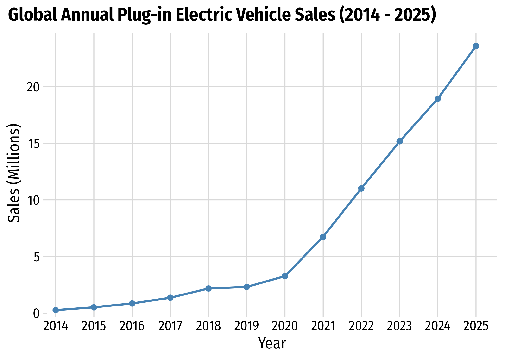
</center>

---

background-color: #fff
class: center

## China is driving the EV revolution

<center>
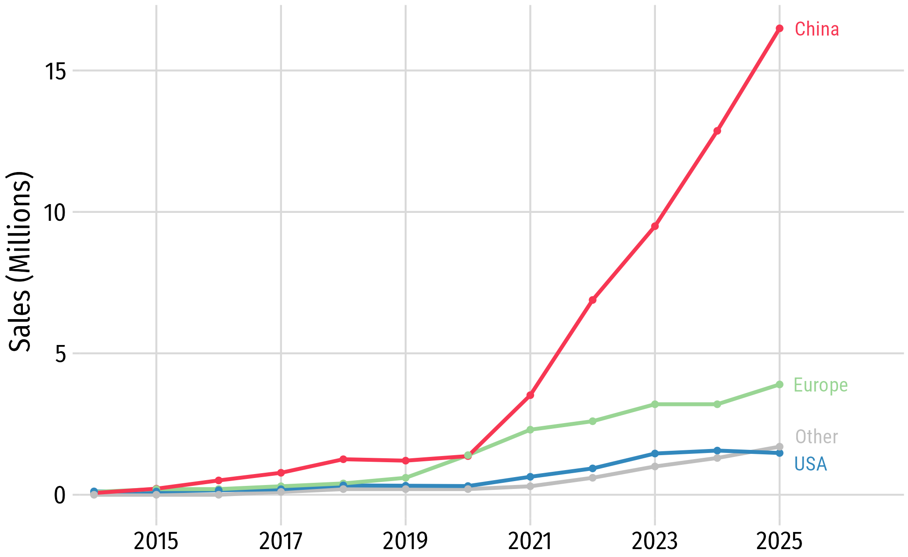
</center>

---

background-color: #fff

<center>
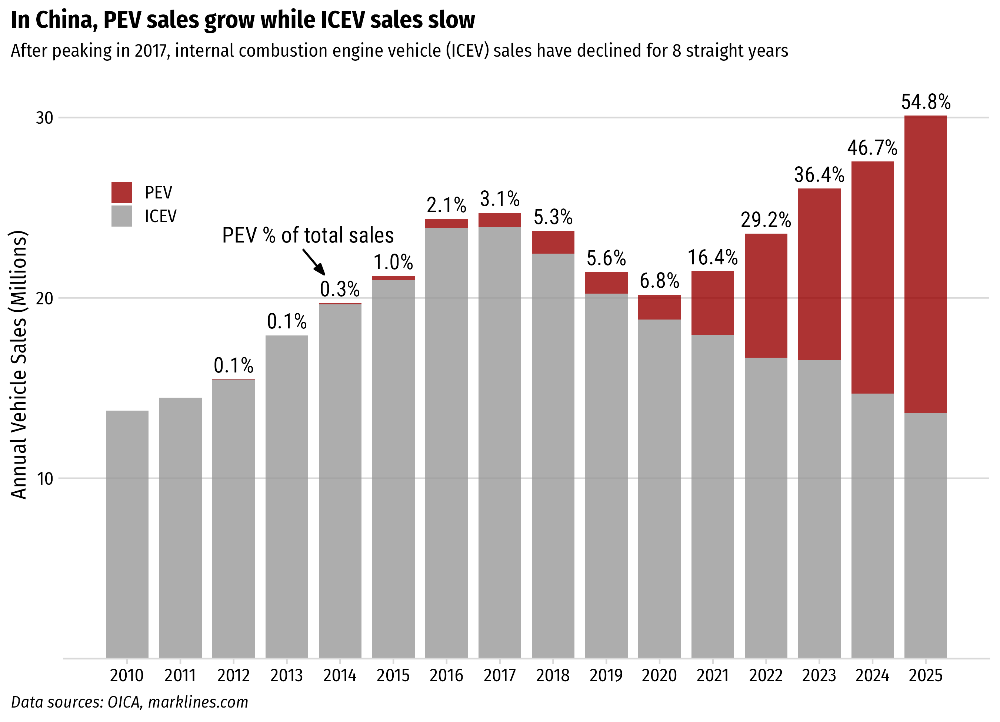
</center>

---

background-color: #fff

<center>
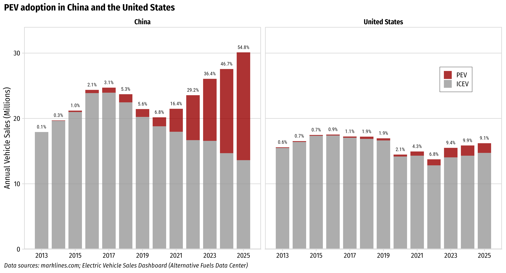
</center>

---

class: center

### China offers more affordable BEVs across all range categories

<center>
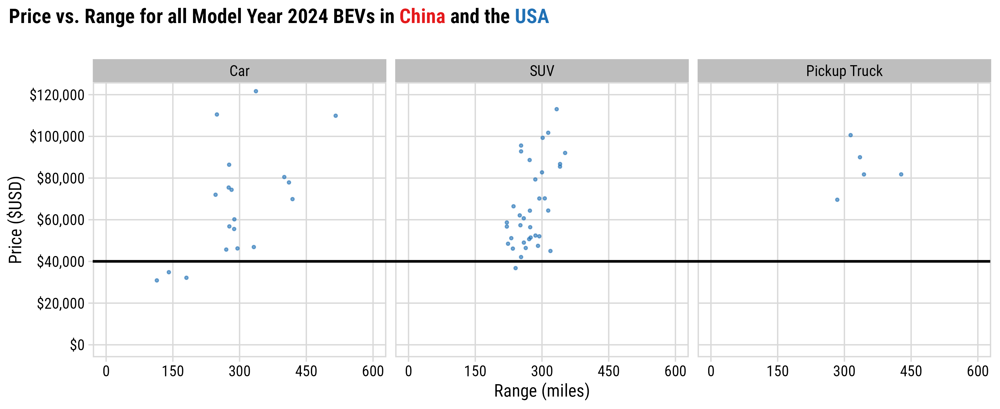
</center>

Data scraped from autocango.com (China) and carsheet.io (USA)

Interactive version at https://jhelvy.github.io/science-2025/

---

class: center

### China offers more affordable BEVs across all range categories

<center>
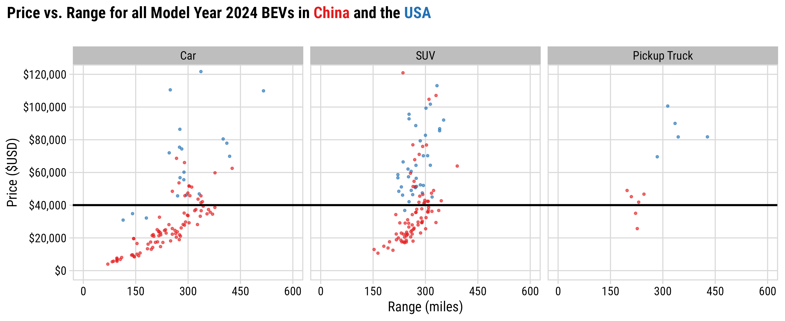
</center>

Data scraped from autocango.com (China) and carsheet.io (USA)

Interactive version at https://jhelvy.github.io/science-2025/

---

class: center

### China offers more affordable BEVs across all range categories

<center>
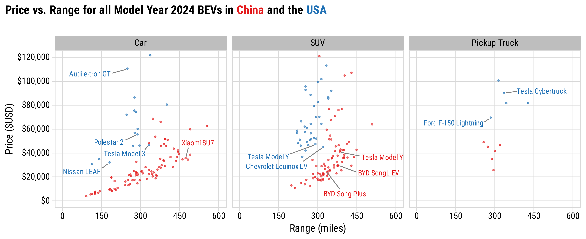
</center>

Data scraped from autocango.com (China) and carsheet.io (USA)

Interactive version at https://jhelvy.github.io/science-2025/

---

background-color: #fff

## .center[China dominates mineral processing supply chain]

<center>
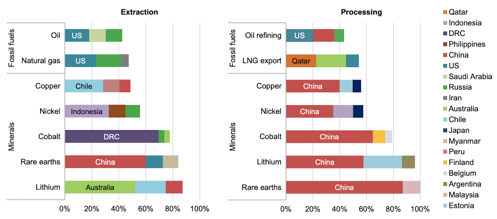
</center>

.font60[Source: https://thegraduatepress.org/2022/04/01/how-china-came-to-dominate-the-supply-chain-of-rare-earths-and-critical-minerals/]

---

class: inverse, middle, center

# How did this happen?

--

# .orange[*Most common answer: it's the subsidies, right?!*]

---

### .center[Estimated $230B in subsidies (2009 - 2023)]

<center>
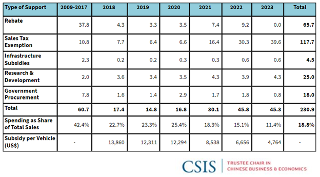
</center>

.font60[https://www.csis.org/blogs/trustee-china-hand/chinese-ev-dilemma-subsidized-yet-striking]

---

background-color: #FFF

.leftcol65[

<center>
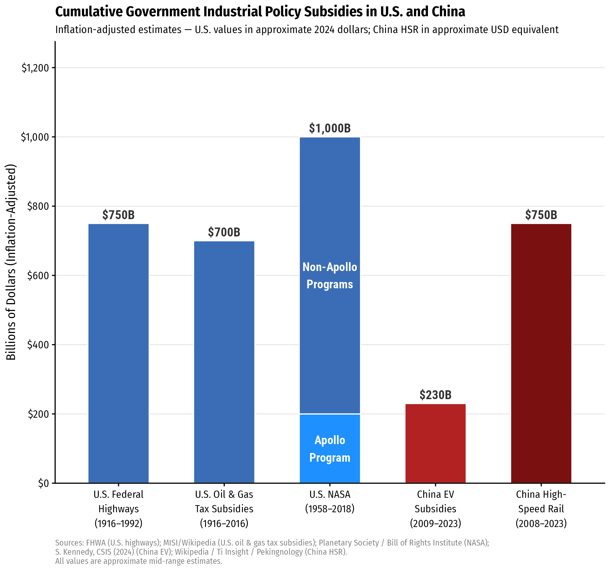
</center>

]

.rightcol35[

.center[China's EV subsidies are on par with typical subsidies needed to start an industry]

]

---

class: inverse, middle, center

# Institutions Matter

---

class: center

# The Chinese Joint Venture System

## 1980s: 以市场换技术 = “Exchange market for technology”

--

<center>
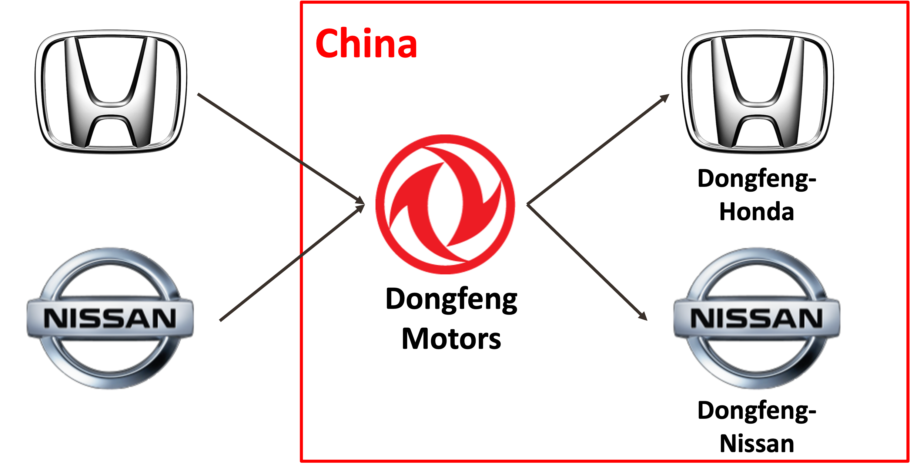
</center>

???

Past research suggests system has largely failed to transfer technology

(Brandt & Thun, 2010; Feng, 2010; Howell, 2016; Huang, 2003; Lazonick & Li, 2012; Nam, 2011)

---

class: inverse, middle, center

### “这就像吸食鸦片一样，一旦你沾染上了就永远也无法戒掉。”

何光远, 中国前机械工业部部长

<br>

### “It's like opium. Once you've had it you will be addicted forever.”

Guangyuan He, Former Minister of Machinery and Industry (Reuters, 2012)

---

class: center

# Consequences of the JV Institution

<br>

### Multinational OEMs lack incentives to bring<br>cutting-edge technologies (EVs)

<br>

### Chinese JV partners lack incentives<br>to independently innovate

---

class: center 

.leftcol55[

<center>
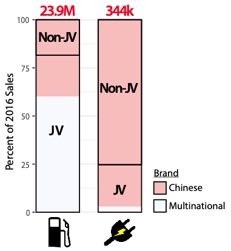
</center>

]

.rightcol45[

<br>

### Multinational OEMs lack incentives to bring cutting-edge technologies (EVs)

<br>

### Chinese JV partners lack incentives to independently innovate

<br><br>

.font70[.left[Helveston, J. P., Y. Wang, V. Karplus, E. Fuchs (2018) “Institutional Complementarities: The Origins of Experimentation in China’s Plug-in Electric Vehicle Industry.” _Research Policy_. 48(1), pg. 206-222]]

]

---

class: inverse, middle, center

# EV Challenges in the US

---

class: center

## US buyers are more opposed to EVs than Chinese buyers

.leftcol65[

<center>
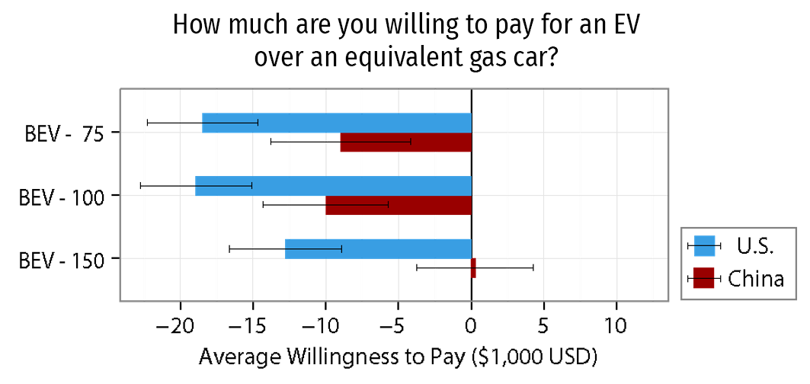
</center>

]

.rightcol35[

<br><br><br><br><br>

.left[.font80[Helveston et al. (2015) "Will subsidies drive electric vehicle adoption? Measuring consumer preferences in the U.S. and China" _Transportation Research Part A: Policy and Practice_. 73, 96–112. DOI: [10.1016/j.tra.2015.01.002](https://www.sciencedirect.com/science/article/abs/pii/S0965856415000038)]]

]

---

class: center, middle 

### US buyers demand far more driving range than Chinese buyers

<center>
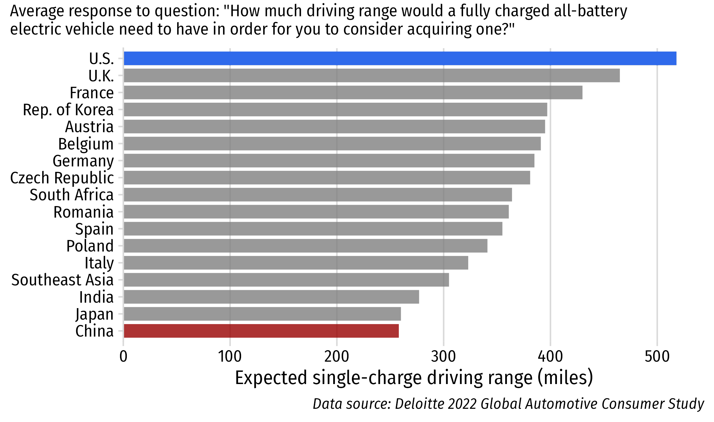
</center>

---

background-image: url("images/top-four-1.png")
background-size: cover

---

background-image: url("images/top-four-2.png")
background-size: cover

---

class: center, middle, inverse

# Using **vehicle listings** to<br>quantify market development

---

class: center
background-color: #fff

<br>

### .center[**`r round(total_listings)`M vehicle listings** from 60k dealerships<br>(2016 - 2025, inclusive)]

<br>

.leftcol[

#### New Vehicles (Million)

```{r}
#| echo: false

summary_dt %>%
    filter(inventory_type == 'new') %>% 
    select(-inventory_type) %>% 
    kbl() 
```

]

.rightcol[

#### Used Vehicles (Million)

```{r}
#| echo: false

summary_dt %>%
    filter(inventory_type == 'used') %>% 
    select(-inventory_type) %>% 
    kbl() 
```

]

---

class: inverse, middle, center

# How many dealerships are carrying PEVs?

---

class: center

## **4/5** dealers have _new_ BEV; **2/5** dealers have _used_ BEV

<center>
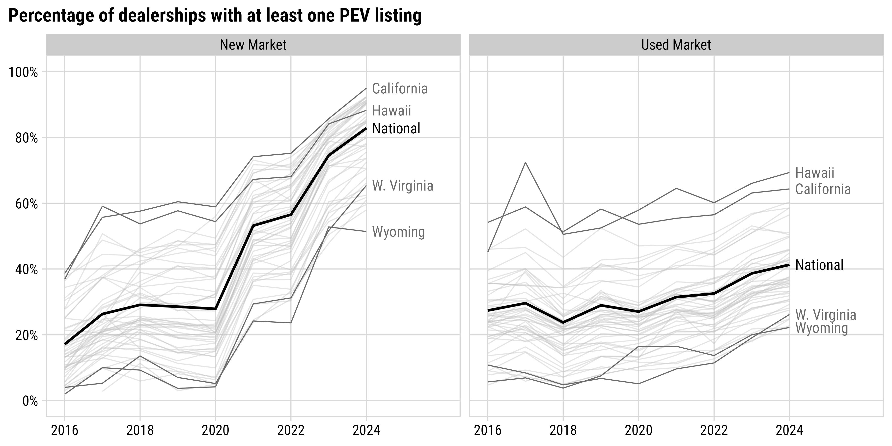
</center>

---

class: center

<br>

## **Majority of BEV listings in high-price segments**

<center>
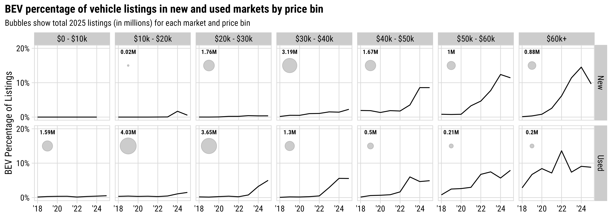
</center>

---

class: inverse, middle, center

# Quantifying BEV Affordability 

---

### .center[**Local vehicle market**: Vehicles in 90 minute driving isochrone]

.leftcol40[

Combine ML algorithm of predicted household vehicle budget with local market characteristics

]

.rightcol60[

<center>
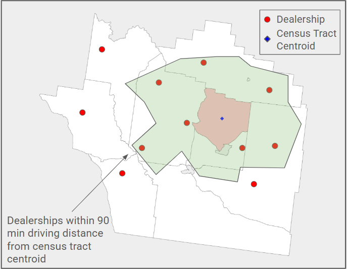
</center>

]

---

background-image: url("images/map_usa.png")
background-size: cover

---

class: inverse, middle, center

# What should the US do?

---

# .center[**A Decade of Policy Whiplash**]

<br>

--

.cols3[

### Obama (2009–2016)

- $7,500 EV tax credit
- Goal: 1M EVs by 2015
- DOE battery R&D investment

]

--

.cols3[

### Trump I (2017–2020)

- Proposed eliminating EV tax credits
- Rolled back fuel economy standards
- Withdrew from Paris Agreement

]

--

.cols3[

### Biden (2021–2024)

- IRA: $369B in clean energy investment
- Expanded EV credits, domestic content rules
- 100% EV federal fleet goal

]

--

### .red[.center[Impossible for automakers<br>to justify long-term BEV investments]]

---

# .center[**Bipartisan goal**: The US needs to counter China's lead in clean energy tech]

<br>

--

## .center[**.red[Response: Ban the Chinese tech]**]

--

## **Out of US market**: Steep tariffs on imported Chinese EVs, batteries, PV modules

--

## **Out of US supply chains**: IRA restrictions on EV subsidy eligibility, stricter Foreign Entities of Concern (FEOC) rules

---


# .center[Lessons from China's Rise in EVs]

<br>

.leftcol[

## .red[Wrong lesson]

### China cheated its way to the top via subsidies → **exclude them**

]

--

.rightcol[

## .green[Right lesson]

### China built real competitive advantages in manufacturing and supply chains →<br> **engage strategically**

]

---

# .center[The Tesla Precedent]

<br>

### China had real security concerns about Tesla: cameras, sensors, data near sensitive sites

--

<br>

### Tesla's solution — targeted compliance, not exclusion:

- Store all vehicle data **within China** (preventing U.S. government access)
- Restrict operations near **designated sensitive areas**
- Use only **Chinese government-approved** mapping systems

--

<br>

### .green[Result: China granted Tesla Full Self-Driving approval — and Tesla became China's top-selling BEV brand]

--

<br>

### .center[Security concerns **can** be managed through transparent standards — not blanket bans]

---

# .center[The European Model]

<br>

### Europe chose engagement over exclusion — and is getting local investment in return

--

<br>

.leftcol[

### **CATL** → Hungary
$7.6B battery plant in Debrecen<br>
100 GWh/year for Mercedes-Benz, BMW, Volkswagen

]

--

.rightcol[

### **BYD** → Hungary
First European EV manufacturing facility<br>
Producing BEVs and PHEVs for the European market

]

--

<br><br>

.center[### European automakers gain access to cutting-edge battery tech<br>while creating local jobs and supply chain resilience]

---

## .center[**Opportunities Blocked by Policy Uncertainty**]

.leftcol[

## Chinese FDI into U.S.

### **Gotion batteries**: Multi-billion dollar investments in Illinois and Michigan

### **Challenge**: Uncertainty around Foreign Entities of Concern (FEOC) status

]

--

.rightcol[

## Technology Licensing Agreements

### **Ford-CATL**: Licensing battery technology in a Michigan plant

### **Challenge**: CATL recently added to DOD's list of "Chinese military companies"

]

---

class: inverse, middle, center

# The Stakes

---

# .center[Three Risks]

<br>

--

### 🌍 **Global Market Share Erosion**
U.S. autos will not be competitive abroad without affordable EVs — GM went from **+25% margins** in China to **–20.5% margins** in just a few years

--

### 💼 **Employment**
U.S. auto employs **10.1 million Americans**, generating **$730B** in annual paychecks (~5% of all private-sector employment)

--

### 🌡️ **Climate**
Light-duty vehicles generate **16% of U.S. carbon emissions** — affordable PEVs are essential to meeting any serious climate target

---

class: center, middle

## The U.S. risks becoming an **"island of tailpipes"**

### Isolated from global automotive innovation<br>while the rest of the world electrifies

---

class: inverse, middle, center

# The Path Forward:<br>Strategic Collaboration

---


---

# .center[Strategic Response Options]

<br>

### 🇨🇦🇲🇽 **North American Integration**: Build sufficient scale through Canada and Mexico partnerships

--

### 📋 **Transparent Security Standards**: Develop compliance frameworks all connected vehicles must meet — *regardless of origin*

--

### 🔋 **Battery Manufacturing Focus**: Prioritize domestic production as platform for commercializing next-gen U.S. technologies

--

### 🤝 **Strategic Chinese Partnerships**: Pursue licensing agreements and FDI with targeted safeguards — not wholesale restrictions

--

### 📈 **Sustained Policy Support**: Restore and maintain IRA incentives long enough for investment to mature

---

class: center, middle

.leftcol[

## The alternative

Exclude Chinese technology<br>
U.S. automakers remain uncompetitive<br>
Global EV transition delayed<br>
Climate goals missed<br>
10M jobs at risk

]

.rightcol[

## The opportunity

Strategic engagement<br>
Access to manufacturing scale + cost advantages<br>
U.S. strengths in advanced R&D preserved<br>
Affordable EVs for American consumers<br>
U.S. remains relevant in global auto

]

---

class: inverse, middle, center

### The question isn't whether to engage with China's EV industry

--

### The question is whether we engage **strategically** —

--

### or get left behind by refusing to engage **at all**

---

class: inverse 
background-image: url("images/blue.jpg")
background-size: cover

<br>

# Thanks!

<br>

### Slides available at <span class="white-text">jhelvy.com/slides</span>

<style>
.white-text a {
  color: white !important;
}
</style>

.footer-large[.white[.right[

@jhelvy `r fa(name = "github", fill = "white")`<br>
jhelvy.com `r fa(name = "link", fill = "white")`<br>
jph@gwu.edu `r fa(name = "paper-plane", fill = "white")`<br>
@jhelvy.bsky.social `r fa(name = "bluesky", fill = "white")`

]]]

---

class: inverse, middle, center

# Extra Slides

---

class: inverse, middle, center

# How hard is it to get to a PEV dealer?

---

background-color: #fff

### **Vehicle accessibility metric**:<br>Road travel time from census tract centroid to<br>nearest dealership with a target vehicle

<center>
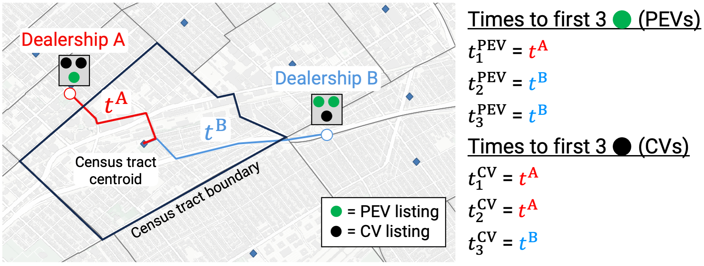
</center>

*Road travel times obtained using Open Source Routing Machine (OSRM)

---

class: middle

.leftcol65[

<center>
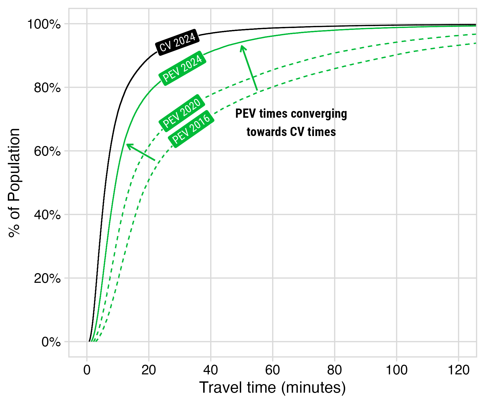
</center>

]

.rightcol35[

## PEV travel times are converging towards conventional vehicle times

80% of pop:

- CV in ~12 min
- PEV in ~22 min (2024)
- PEV in ~60 min (2016)

]

---

class: middle

.leftcol65[

<center>
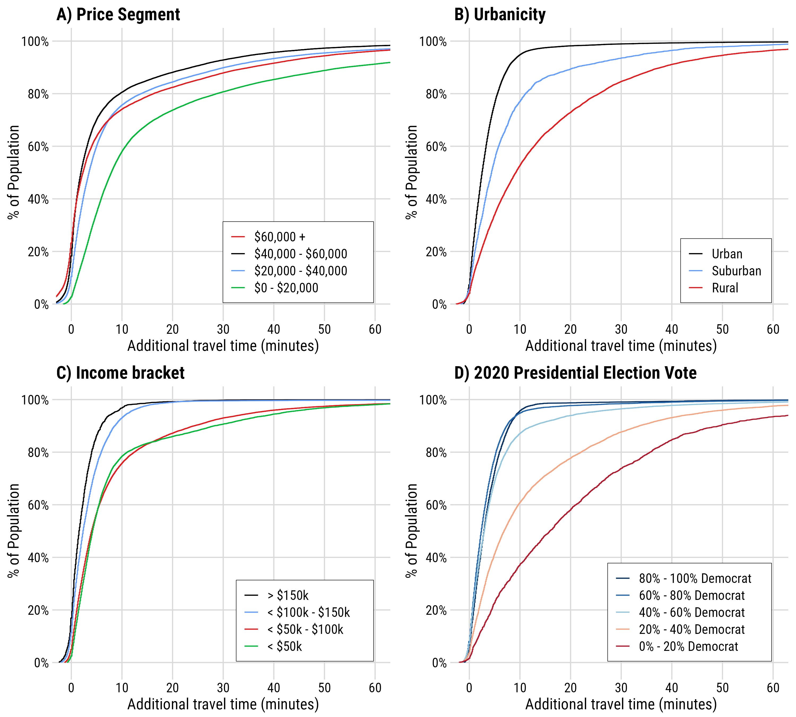
</center>

]

.rightcol35[

### Additional travel times (PEV - CV) by demographic blocks shows disparities

Places with worse PEV access:

- Lower income areas 
- Rural areas
- Republican strongholds

]

---

class: center
background-color: #fff

# The BEV Deserts of America

<center>
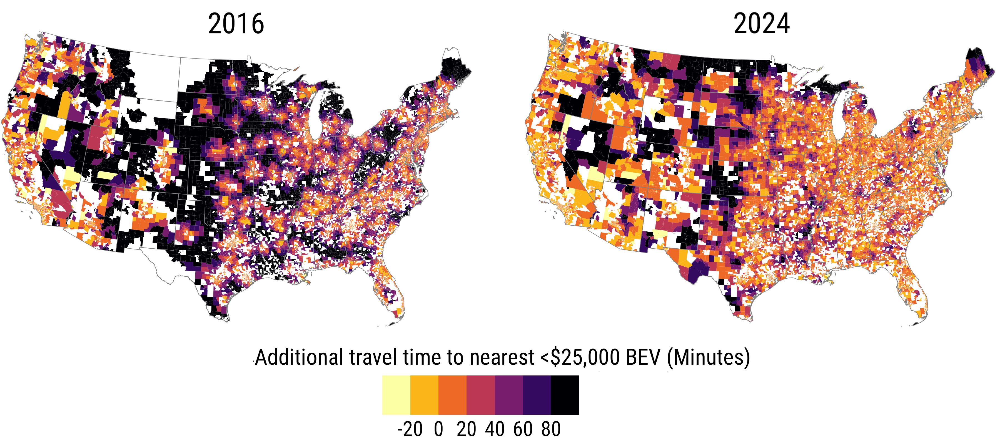
</center>

---

class: middle, center
background-color: #fff

## **Key Finding**: EV accessibility is spatially concentrated

### Transportation electrification will be **geographically clustered** rather than evenly distributed
