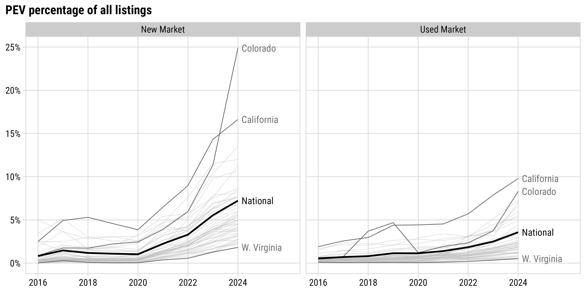
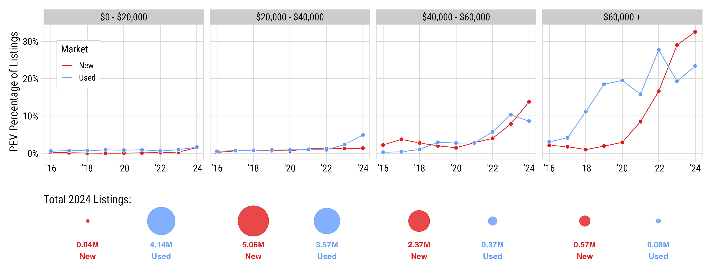

class: middle, center

## Addressing the **“innovation-needs paradox”**:

## The people most likely to benefit from a technology<br>are often the last ones to adopt it.

---

class: center
background-color: #fff

### .center[**Data**: `r round(total_listings, 1)`M vehicle listings from ~60k dealerships (marketcheck.com)<br>(2016 - 2024, inclusive)]

#### New Vehicles

```{r}
#| echo: false

summary_dt %>%
    filter(inventory_type == 'new') %>% 
    select(-inventory_type) %>% 
    kbl() 
```

#### Used Vehicles

```{r}
#| echo: false

summary_dt %>%
    filter(inventory_type == 'used') %>% 
    select(-inventory_type) %>% 
    kbl() 
```

---

class: inverse, middle, center

# How many dealerships are carrying PEVs?

---

class: center

## **4/5** dealers have _new_ BEV; **2/5** dealers have _used_ BEV

<center>

</center>

---

class: center

## PEVs still a small % of overall listings (7% new, 4% used)

<center>

</center>

---

class: center

## PEV affordability still a major challenge<br>**Majority of growth in high-price segments**

<center>

</center>

---

class: inverse, middle, center

# How hard is it to get to a PEV dealer?

---

background-color: #fff

### **Vehicle accessibility metric**:<br>Road travel time from census tract centroid to<br>nearest dealership with a target vehicle

<center>

</center>

*Road travel times obtained using Open Source Routing Machine (OSRM)

---

class: middle

.leftcol65[

<center>

</center>

]

.rightcol35[

## PEV travel times are converging towards conventional vehicle times

80% of pop:

- CV in ~12 min
- PEV in ~22 min (2024)
- PEV in ~60 min (2016)

]

---

class: middle

.leftcol65[

<center>

</center>

]

.rightcol35[

### Additional travel times (PEV - CV) by demographic blocks shows disparities

Places with worse PEV access:

- Lower income areas 
- Rural areas
- Republican strongholds

]

---

class: middle, center
background-color: #fff

.leftcol70[

<center>

</center>

]

.rightcol30[

### “PEV Deserts” exist in some areas, particularly in <$20,000 price range

]

---

class: middle, center
background-color: #fff

## **Key Finding**: EV accessibility is spatially concentrated

### Transportation electrification will be **geographically clustered** rather than evenly distributed

<center></center>
